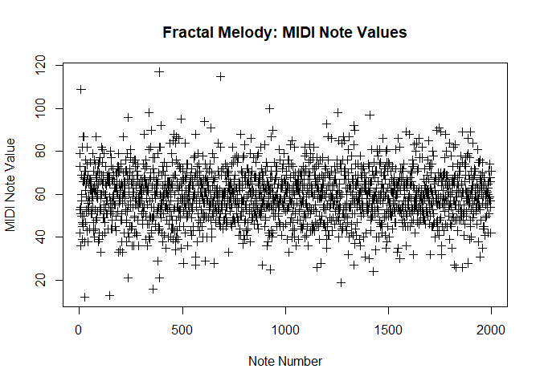

<!-- README.md is generated from README.Rmd. Please edit that file -->

# Generating Fractal Melodies

<!-- badges: start -->

<!-- badges: end -->

A method implemented in R to generate fractal melodies using the method
described by Beauvois (2007)
(<https://www.jstor.org/stable/10.1525/mp.2007.24.3.247>). The R script
generates a fractal time series, and then the Matlab script generates a
MIDI sequence using that time series. The result is a melody with
self-similar pitch fluctuations. Note: the Matlab script requires the
MIDI Toolbox.

## Generating 1/f Time Series

The R library “fractal” is used to generate a time series that exhibits
a user-specified 1/f structure, as estimated by the Hurst exponent. The
time series is generated by a Fractional Guassian Noise (FGN) process,
which reflects a stochastic stationary Gaussian process. Parameters for
the FGN, such as the mean, variance, and Hurst exponent, can be set by
the user. To estimate the 1/f structure of the generated time series,
the script uses pengFit and rsFit, which are two modern methods of
estimating the Hurst Exponent. Both should be used.

``` r
var = 100   # variance of distribution
mu = 100    # mean of distribution
h = 0.25    # hurst exponent
n = 2000    # sample size of time series
```

A plot of the 1/f time series generated by a FGN. Note the stationarity
of the time series. 

Next, the time series is standardized (i.e., mean = 0, SD = 1) before it
is converted to MIDI note values using a method described by Beauvois
(2007). The result is a vector of MIDI note values that exhibit 1/f
pitch fluctuations that can be used to generate fractal melodies. Here,
the pitch fluctuations are centered around a note value of 60 (i.e.,
center C).


